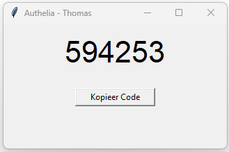

# TOTP Generator/Authenticator - Authelia



Dit Python-script is een lichtgewicht desktopapplicatie voor het genereren van 2FA (Two-Factor Authentication) codes. 
Het is ontwikkeld om snel TOTP-codes te verkrijgen voor een **Authelia** omgeving.

## Functionaliteit
*   **Real-time updates:** De code wordt elke seconde ververst om synchroon te blijven met de systeemtijd.
*   **Copy-to-Clipboard:** Met de knop "Kopieer Code" wordt de 6-cijferige code direct naar het klembord gekopieerd.
*   **Foutafhandeling:** Geeft een melding indien de `.env` file of de geheime sleutel ontbreekt of onjuist is.

## Installatie

Om dit script lokaal te draaien, moeten de volgende Python-libraries geïnstalleerd zijn:

```bash
pip install pyotp python-dotenv
```

##  Configuratie

1. Maak in de hoofdmap een .env aan.
2. Voeg je geheime sleutel toe aan dit bestand in BASE32:
```text
TOTP_SECRET=JOUW_GEHEIME_CODE_HIER
```
---
*Project Howest Systeem en Netwerkbeheer - Thomas*
